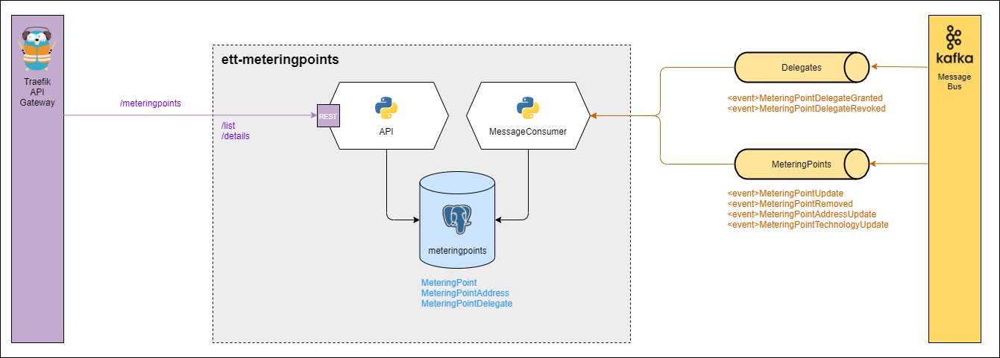

# eo-meteringpoints
This repository contains the codebase for the Metering Point domain which is a part of [Energy Origin](https://github.com/Energinet-DataHub/energy-origin).

## MeteringPoint
A [meteringpoint](https://github.com/Energinet-DataHub/energy-origin/blob/main/glossary.md#meteringpoint) is a physical or virtual point in the electricity supply network, which electrical energy i measured, calculated as a function of multiple [measurements](https://github.com/Energinet-DataHub/energy-origin/blob/main/glossary.md#measurement) and actors.

Every meteringpoint has a unique id named GSRN. A metering point can measure either energy produced(eg. solar panels and wind turbines) or consumed(eg. office building or average electricity meter in a private home). When producing energy, the energy can be of different technology types eg. coal, solar and nuclear.

Read full meteringpoint description [here](https://github.com/Energinet-DataHub/energy-origin/blob/main/glossary.md#meteringpoint).

## MeteringPointAddress
A meteringpoint address is simply the addres in which the meteringpoint is located. See MeteringPoint attributes [here](https://github.com/Energinet-DataHub/energy-origin/blob/main/glossary.md#meteringpoint).

## MeteringPointDelegate
A meteringpoint delegate identifies which actors(identified by it's subject) has been delegated access to a Meteringpoint(identified by it's GSRN number).

# Architecture

*Service architecture demontrating measutrement and external dependencies.*

The meteringpoint domain consists of three parts:
- API
- MessageConsumer
- Database

## API
Provides a interface for accessing meteringpoints.

## MessageConsumer
Provides a interface for updating stored MeteringPoints and MeteringPointDelegates. This is used by other services within the cluster.

All communication happens through a MessageBus which the MessageConsumer have subscribed to certain messages of specific event types, as seen in the architecture diagram above.

## Database
Used for storing [MeteringPoints](#meteringpoint), [MeteringPointAddresses](#meteringpointaddress) and [MeteringPointDelegates](#meteringpointdelegate).

# Building and running service
Information about building and running this service can be found [here](doc/running_service.md).

# Development environment
Instruction about how to setup a development environment or see the specific requirement go [here](doc/contrib/shared/README.md).
